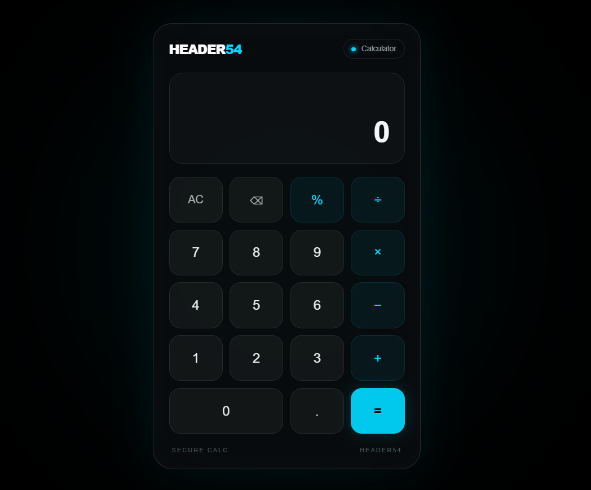

# 🔢 HEADER54 Calculator

A clean and modern **Basic Calculator** built with **HTML, CSS, and JavaScript**, designed with a minimal **black + cyan cybersecurity-inspired UI**.

The interface is focused on simplicity, readability, and a premium glassmorphism-style look.

---

## ✨ Preview




---

## 🚀 Features

- 🧮 Basic arithmetic operations
  - Addition `+`
  - Subtraction `−`
  - Multiplication `×`
  - Division `÷`
  - Modulo `%`
- 🔢 Decimal number support
- 🧹 Clear / All Clear button
- ⌫ Backspace / delete button
- ⌨️ Keyboard support
- ⚠️ Division-by-zero error handling
- 📱 Responsive layout
- 🌑 Dark cybersecurity-inspired theme
- 💠 Cyan accent color
- ✨ Glassmorphism-style calculator card
- 📟 Clean digital display
- 🔵 Hover and click animations

---

## 🎨 UI Design

The calculator follows a **HEADER54** visual identity:

- **Background:** Deep black
- **Primary Accent:** Cyan / electric blue
- **Cards:** Dark translucent surfaces
- **Borders:** Subtle white/cyan borders
- **Buttons:** Rounded modern design
- **Operators:** Cyan-highlighted controls
- **Equals Button:** Bright cyan CTA
- **Typography:** Clean and minimal

---

## 🛠️ Technologies Used

| Technology | Purpose |
|---|---|
| HTML5 | Calculator structure |
| CSS3 | UI, layout, responsive design |
| JavaScript | Calculator logic and interactions |

---

## 📁 Project Structure

```text
calculator/
│
├── index.html
├── style.css
├── script.js
├── screenshot.png
└── README.md
```

---

## ⚙️ How to Run

### 1. Clone the repository

```bash
git clone https://github.com/YOUR-USERNAME/header54-calculator.git
```

### 2. Open the project

```bash
cd header54-calculator
```

### 3. Run

Simply open:

```text
index.html
```

in your browser.

You can also use **VS Code + Live Server** for development.

---

## 🧮 Supported Operations

### Addition

```text
10 + 5 = 15
```

### Subtraction

```text
10 - 5 = 5
```

### Multiplication

```text
10 × 5 = 50
```

### Division

```text
10 ÷ 5 = 2
```

### Modulo

```text
10 % 3 = 1
```

---

## ⌨️ Keyboard Shortcuts

The calculator also supports keyboard input.

| Key | Action |
|---|---|
| `0-9` | Enter number |
| `.` | Decimal |
| `+` | Addition |
| `-` | Subtraction |
| `*` | Multiplication |
| `/` | Division |
| `%` | Modulo |
| `Enter` | Calculate |
| `Backspace` | Delete |
| `Escape` | Clear |

---

## 📱 Responsive Design

The calculator is designed to work across:

- 💻 Desktop
- 💻 Laptop
- 📱 Mobile
- 📟 Tablet

The layout automatically adjusts for smaller screens.

---

## 🔐 Design Concept

The project uses a cybersecurity-inspired visual style rather than a traditional calculator interface.

The main design idea is:

```text
BLACK
  ↓
DARK GLASS
  ↓
CYAN ACCENTS
  ↓
MINIMAL UI
  ↓
PREMIUM CALCULATOR
```

---

## 🔮 Future Improvements

Possible future features:

- [ ] Calculation history
- [ ] Scientific calculator mode
- [ ] Dark / light theme switch
- [ ] Memory functions `M+`, `M-`, `MR`, `MC`
- [ ] Copy result button
- [ ] Calculation history panel
- [ ] Advanced keyboard controls
- [ ] Calculator sound effects
- [ ] Animated background
- [ ] PWA support
- [ ] Installable mobile version

---

## 👨‍💻 Author

**HEADER54**

Cybersecurity enthusiast interested in:

- Penetration Testing
- Web Application Security
- Network Security
- SOC / Security Operations
- Python
- Security Tools & Projects

---

## ⭐ Support

If you like this project, consider giving it a ⭐ on GitHub.

---

## 📄 License

This project is open-source and available for learning and personal use.

---

### 💙 Built with HTML, CSS & JavaScript

**HEADER54 — Learn. Build. Secure.**
